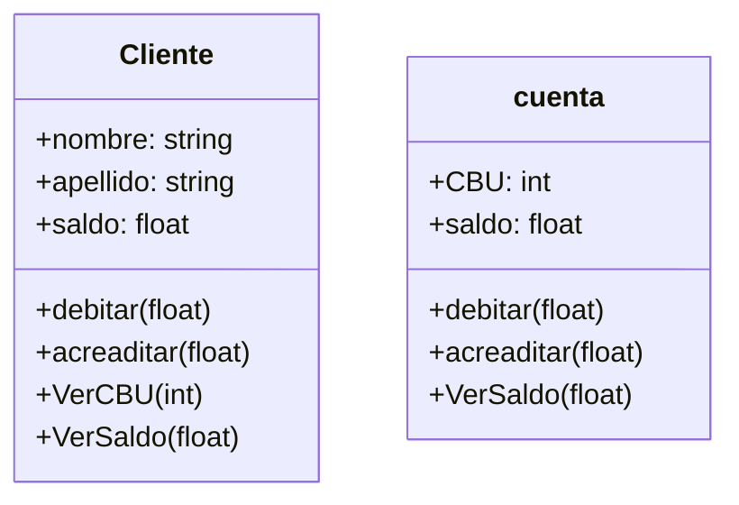

## Diagrama de clases - Banco.core

```mermaid
classDiagram

class Cliente{
    +nombre: string
    +apellido: string
    +saldo: float
    +debitar(float)
    +acreaditar(float)
    +VerCBU(int)
    +VerSaldo(float)
}
class cuenta{
    +CBU: int
    +saldo: float
    +debitar(float)
    +acreaditar(float)
    +VerSaldo(float)
}

```